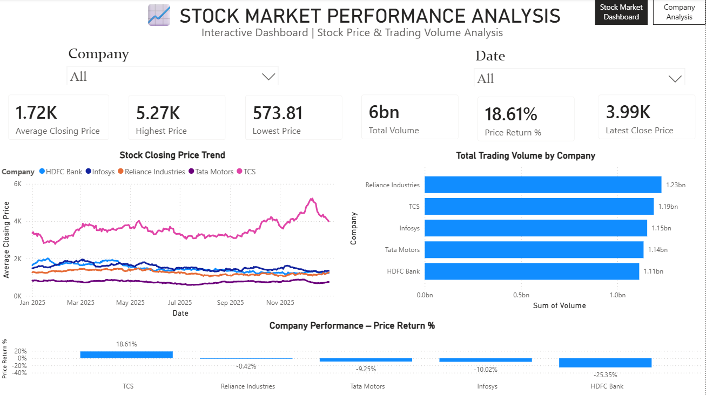
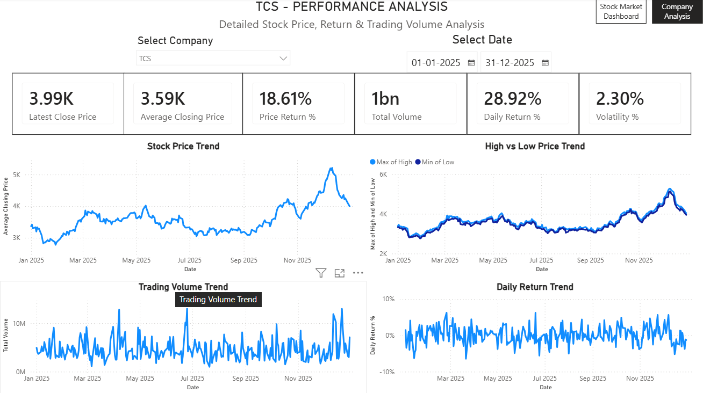

# Stock Market Performance & Trading Analytics Dashboard

An interactive **Power BI Business Intelligence dashboard** designed to analyze stock-market performance, stock price movements, trading volume, company-level performance, daily returns, and volatility.

The dashboard transforms historical stock-market data into an interactive analytical solution using **Microsoft Power BI, Power Query, and DAX**.

---

## 📊 Project Overview

**Stock Market Performance & Trading Analytics Dashboard** is a Business Intelligence project developed in Microsoft Power BI to analyze and visualize historical stock-market data.

The dashboard provides both:

* **Market-level performance analysis**
* **Company-level performance analysis**

Users can interact with the dashboard using **Company** and **Date** filters to explore stock prices, trading volume, returns, price movements, and volatility.

This project demonstrates practical skills in:

* Data Analysis
* Business Intelligence
* Microsoft Power BI
* Power Query
* DAX
* Data Visualization
* Dashboard Design
* Interactive Reporting
* Data Storytelling

---

## 🎯 Project Objectives

The main objectives of this project are to:

* Analyze historical stock-market performance.
* Monitor stock closing-price trends.
* Compare performance across multiple companies.
* Analyze trading volume by company.
* Calculate and visualize price returns.
* Analyze daily stock returns.
* Measure stock-price volatility.
* Compare high and low price movements.
* Provide interactive company and date filtering.
* Build a professional Business Intelligence portfolio project.

---

## 🛠️ Tools & Technologies

| Technology             | Purpose                                              |
| ---------------------- | ---------------------------------------------------- |
| **Microsoft Power BI** | Dashboard development and interactive visualization  |
| **Power Query**        | Data cleaning and transformation                     |
| **DAX**                | Measures, KPIs, returns, and analytical calculations |
| **CSV / Excel**        | Source stock-market data                             |
| **GitHub**             | Project versioning, hosting, and documentation       |

---

## 📁 Repository Structure

```text
stock-market-trading-analytics-powerbi/
│
├── README.md
│
└── Stock-Market-Performance-Trading-Analytics/
    │
    ├── Dashboard/
    │   └── Stock Market Dashboard.pbix
    │
    ├── Dataset/
    │   └── Stock Market Dataset
    │
    ├── Screenshots/
    │   ├── Dashboard-Page-1.png
    │   └── Dashboard-Page-2.png
    │
    └── Documentation/
        └── Stock_Market.pdf
```

---

## 📈 Dashboard Overview

The Power BI solution contains two analytical pages:

### 1. Stock Market Performance Analysis

Provides a high-level overview of stock-market performance across companies and selected time periods.

### 2. Company Performance Analysis

Provides detailed analysis of an individual company's stock performance, price movements, trading activity, returns, and volatility.

---

# 📊 Page 1 — Stock Market Performance Analysis

The first dashboard page provides a market-level overview of stock performance across different companies.

## Key KPIs

* **Average Closing Price**
* **Highest Price**
* **Lowest Price**
* **Total Trading Volume**
* **Price Return %**
* **Latest Close Price**

## Visual Analysis

* Stock Closing Price Trend
* Total Trading Volume by Company
* Company Performance by Price Return %
* Company Filter
* Date Filter

This page allows users to quickly understand overall market performance and compare companies.

---

# 🏢 Page 2 — Company Performance Analysis

The second dashboard page focuses on detailed company-level analysis.

Users can select a specific company and date range to analyze its performance.

## Key KPIs

* **Latest Close Price**
* **Average Closing Price**
* **Price Return %**
* **Total Volume**
* **Daily Return %**
* **Volatility %**

## Visual Analysis

* Stock Price Trend
* High vs Low Price Trend
* Trading Volume Trend
* Daily Return Trend

This page helps users evaluate individual company performance, stock-price movements, trading activity, returns, and volatility.

---

# 📸 Dashboard Preview

## Page 1 — Stock Market Performance Analysis



## Page 2 — Company Performance Analysis



---

# 💡 Key Insights

The dashboard helps users identify:

* Companies with the highest and lowest price returns.
* Stock price trends over selected periods.
* Companies contributing the highest trading volume.
* Daily positive and negative return movements.
* Periods of high and low stock-price volatility.
* Differences between high and low stock prices.
* Changes in trading activity across companies and time periods.

---

# 🔄 Data & Methodology

The project follows a structured Business Intelligence workflow:

### Step 1 — Data Collection

Historical stock-market data is used as the primary data source.

### Step 2 — Data Cleaning

The dataset is cleaned and transformed using **Power Query**.

### Step 3 — Data Preparation

The transformed data is prepared for analysis in **Power BI**.

### Step 4 — DAX Calculations

DAX measures are created for KPIs and analytical calculations.

### Step 5 — Dashboard Development

Interactive charts, KPI cards, slicers, and analytical visuals are developed.

### Step 6 — Analysis

Stock prices, trading volume, returns, and volatility are analyzed.

### Step 7 — Dashboard Validation

Calculations and visual interactions are checked to ensure the dashboard provides meaningful analytical results.

---

# 🧮 Key DAX Analysis

DAX measures are used to calculate important financial and analytical metrics, including:

* Average Closing Price
* Highest Stock Price
* Lowest Stock Price
* Total Trading Volume
* Price Return %
* Latest Close Price
* Daily Return %
* Stock Price Volatility %

These calculations power the dashboard KPIs and interactive visualizations.

---

# 🎛️ Interactive Features

The dashboard includes interactive features such as:

* **Company Slicer**
* **Date Slicer**
* Interactive KPI Cards
* Interactive Charts
* Cross-filtering between visuals
* Company-level performance comparison
* Time-period analysis

Users can dynamically change the selected company and time period to explore different market scenarios.

---

# 🚀 How to Use

1. Download the `.pbix` file from this repository.
2. Open the file using **Microsoft Power BI Desktop**.
3. Refresh the dataset if required.
4. Use the **Company slicer** to select a company.
5. Use the **Date slicer** to select the required time period.
6. Interact with the charts and KPI cards.
7. Analyze stock prices, trading volume, returns, and volatility.

---

# 📚 Project Documentation

Detailed project documentation is available in the repository.

📄 **[View Project Documentation](Stock-Market-Performance-Trading-Analytics/Documentation/Stock_Market.pdf)**

The documentation provides additional information about:

* Project objectives
* Dataset
* Data preparation
* Power BI dashboard
* DAX calculations
* Dashboard analysis
* Key insights

---

# 🔮 Future Enhancements

The project can be further enhanced with:

* Real-time stock-market data integration.
* Additional financial KPIs.
* Sector-wise stock analysis.
* Benchmark and market-index comparison.
* Advanced stock-price forecasting.
* Automated data refresh.
* Additional interactive dashboard pages.
* Advanced risk analysis.
* Portfolio performance analysis.
* Stock prediction using Machine Learning.

---

# 🎓 Skills Demonstrated

This project demonstrates practical experience in:

* **Business Intelligence**
* **Data Analysis**
* **Power BI Dashboard Development**
* **Power Query**
* **DAX**
* **Data Cleaning & Transformation**
* **KPI Development**
* **Data Visualization**
* **Interactive Dashboard Design**
* **Business Data Storytelling**

---

# 👨‍💻 Author

**Abhishek Pal**

Aspiring **Data Analyst / Data Scientist** with an interest in:

* Data Science & Data Analytics
* Business Intelligence & Power BI
* Python
* Artificial Intelligence & Machine Learning

---

# ⭐ Project

If you find this project useful or interesting, consider giving the repository a **star ⭐** on GitHub.

---

## 📌 Disclaimer

This project is created for **educational and portfolio purposes**. The analysis is based on historical data and should not be considered financial or investment advice.
